# EA Logic Flowcharts

This document provides visual flowcharts to understand the EA's decision-making process.

---

## Main OnTick Flow

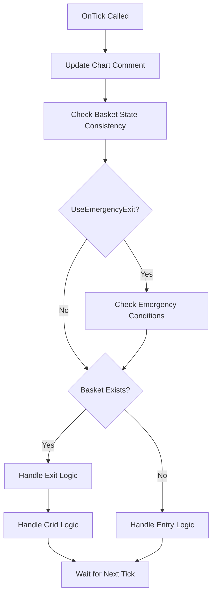

---

## Entry Logic Flow

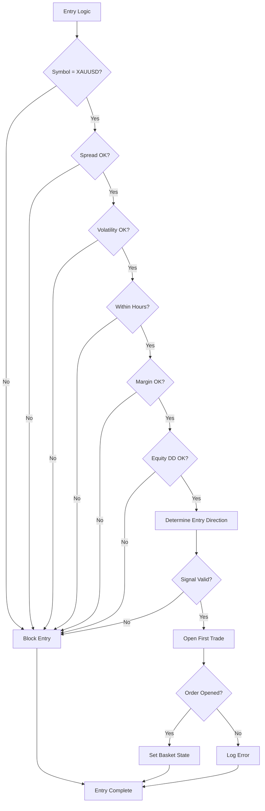

---

## Entry Mode Decision

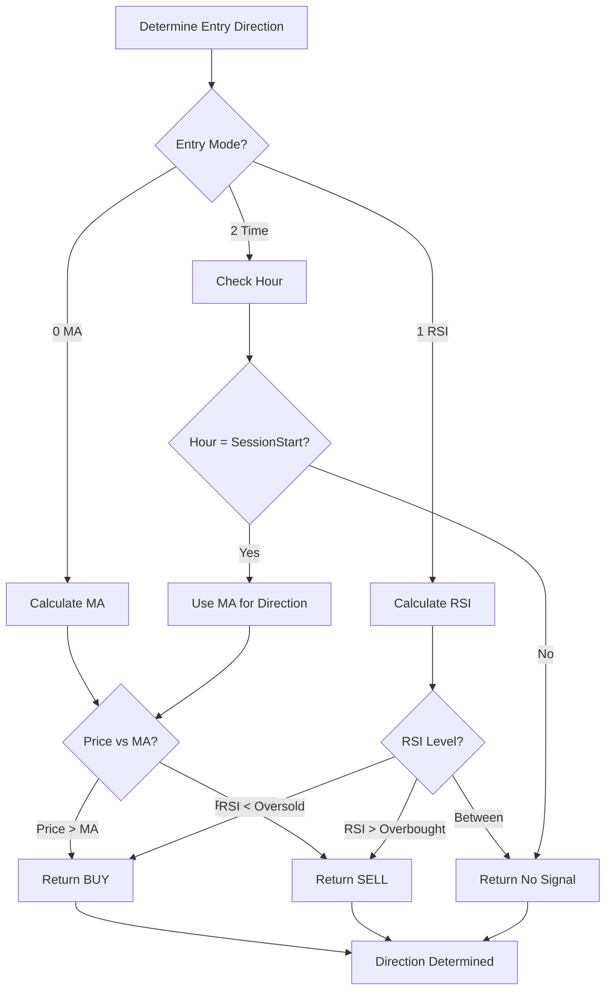

---

## Grid Logic Flow

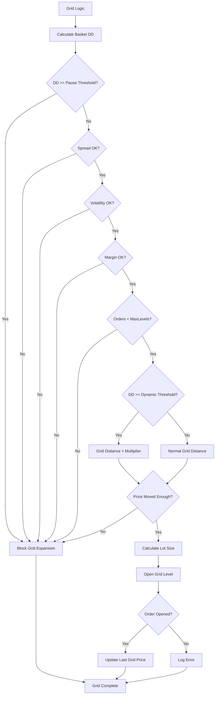

---

## Exit Logic Flow

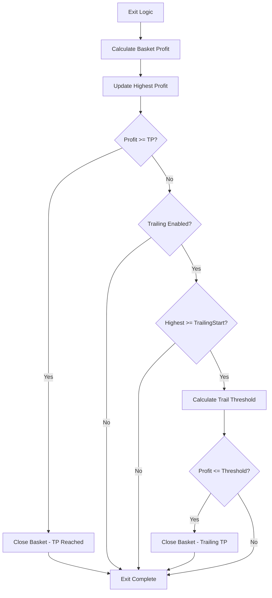

---

## Emergency Close Logic

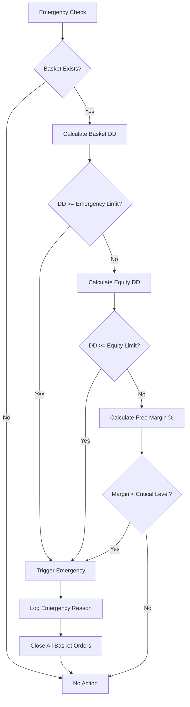

---

## Basket Close Process

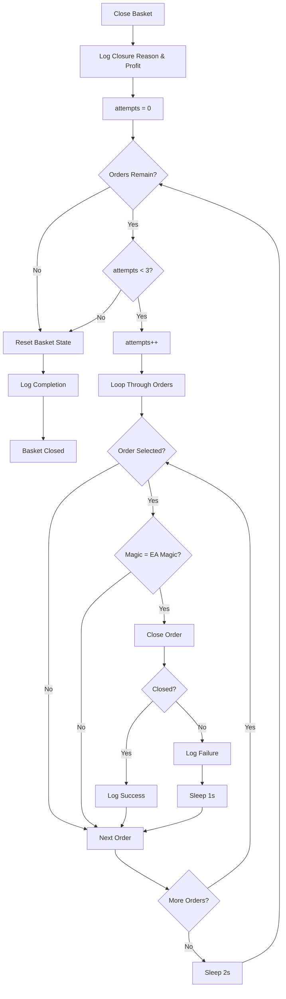

---

## Filter Decision Tree

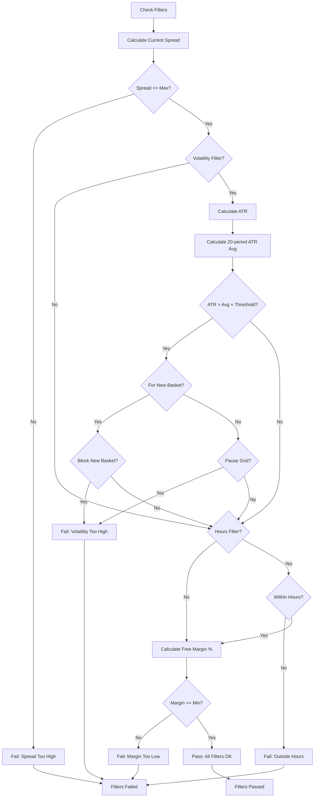

---

## Risk Level Decision Tree

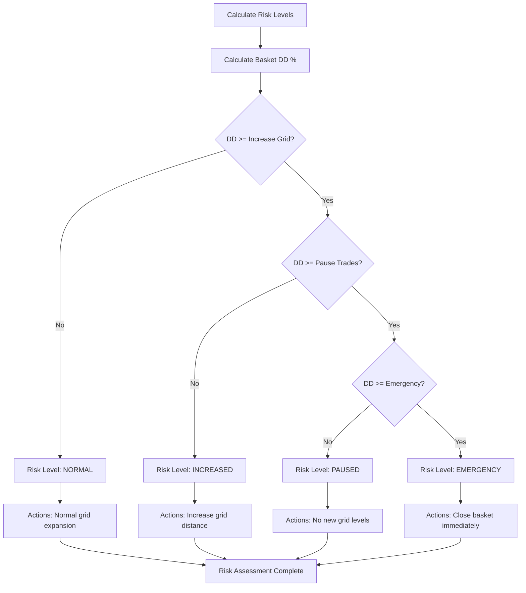

---

## State Machine

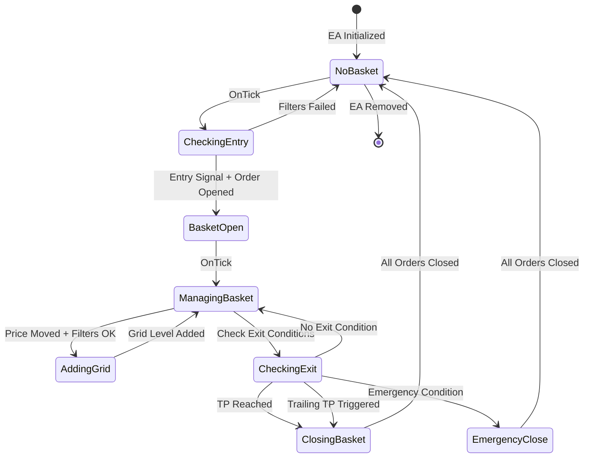

---

## Lot Size Calculation

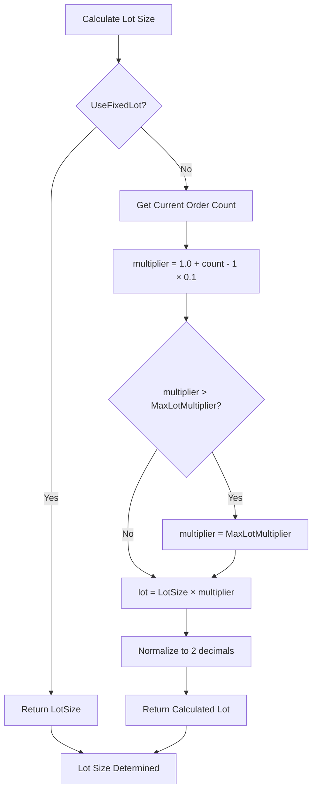

---

## Basket State Recovery

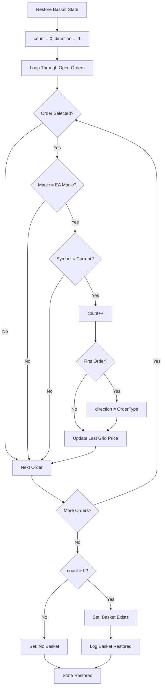

---

## Understanding the Flowcharts

### Symbols Used

- **Rectangle:** Process or action
- **Diamond:** Decision point (yes/no)
- **Rounded Rectangle:** Start/end point
- **Arrows:** Flow direction

### Color Coding (if viewing in color)

- **Green paths:** Success/continue
- **Red paths:** Failure/block
- **Blue:** Information/calculation
- **Orange:** Warning/emergency

### How to Use These Flowcharts

1. **For understanding:** Follow the flow to see how decisions are made
2. **For debugging:** Trace the path to find where EA is blocking
3. **For modification:** Identify where to add/change logic
4. **For testing:** Verify EA follows these flows during testing

### Key Takeaways

1. **Multiple safety checks:** EA checks many conditions before acting
2. **Sequential filters:** Each filter must pass before proceeding
3. **State-based logic:** EA behavior depends on basket state
4. **Emergency priority:** Emergency checks happen before normal logic
5. **Graceful failure:** EA logs and continues when operations fail

---

## Typical Execution Paths

### Path 1: Successful Entry
```
OnTick → Check State → No Basket → Entry Logic →
All Filters Pass → Entry Signal Valid → Order Opens →
Basket State Set → Wait for Next Tick
```

### Path 2: Grid Expansion
```
OnTick → Check State → Basket Exists → Exit Logic (no exit) →
Grid Logic → DD Below Pause → Filters Pass → Price Moved →
Grid Order Opens → Update Last Price → Wait for Next Tick
```

### Path 3: Normal TP Close
```
OnTick → Check State → Basket Exists → Exit Logic →
Calculate Profit → Profit >= TP → Close All Orders →
Reset State → Wait for Next Tick (No Basket)
```

### Path 4: Emergency Close
```
OnTick → Check State → Emergency Check → Basket DD High →
Trigger Emergency → Log Reason → Close All Orders →
Reset State → Wait for Next Tick (No Basket)
```

### Path 5: Blocked by Filters
```
OnTick → Check State → No Basket → Entry Logic →
Spread Check Fails → Block Entry → Wait for Next Tick
```

---

These flowcharts represent the complete logic of the EA. Use them as a reference when configuring, testing, or troubleshooting the EA.
